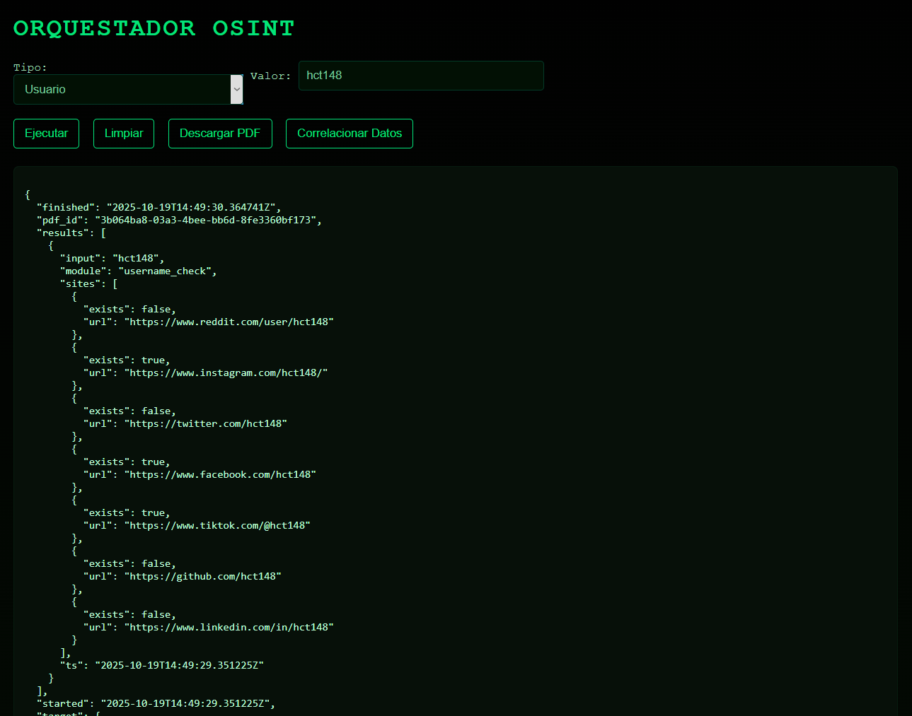
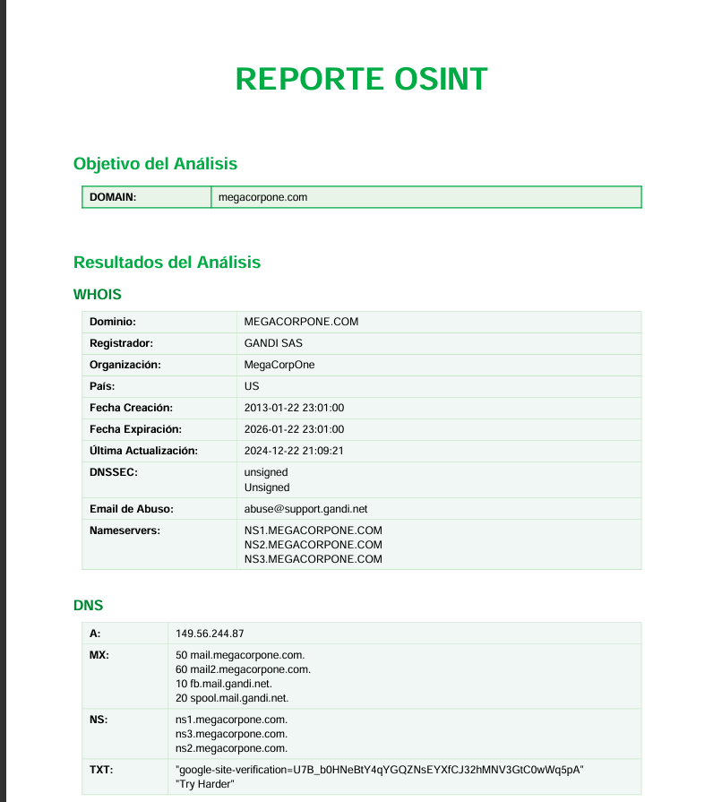
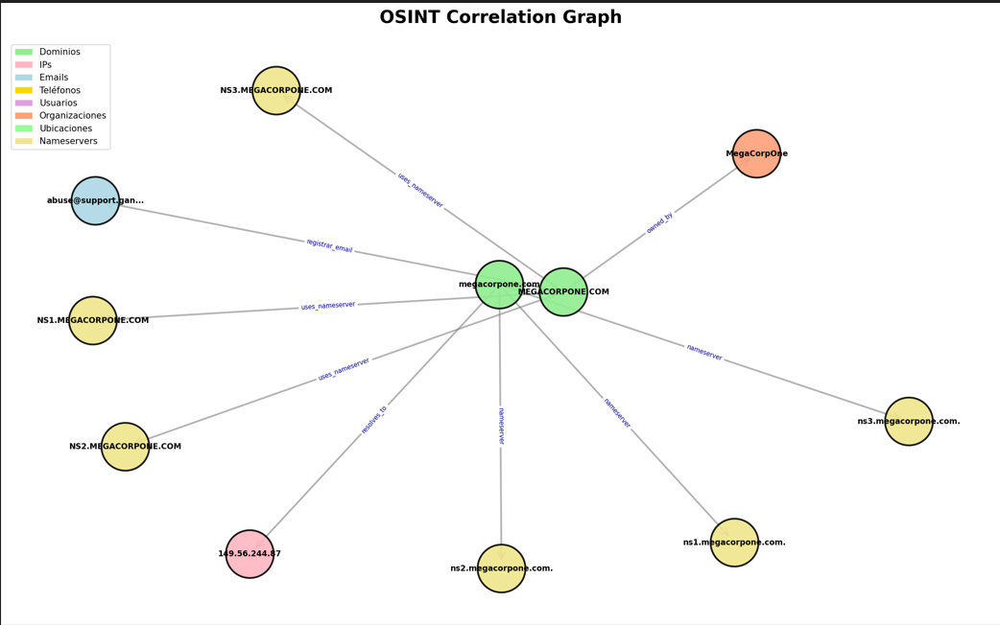

# Orquestador OSINT - Guía de Uso
1. [Descripción General](#descripción-general)  
2. [Instalación](#instalación)  
3. [Interfaz Web](#interfaz-web)  
4. [Ejecución de Análisis](#ejecución-de-análisis)  
5. [Generación de Informes PDF](#generación-de-informes-pdf)  
6. [Correlación de Datos y Grafo](#correlación-de-datos-y-grafo)  
7. [Módulos Incluidos](#módulos-incluidos) 

## Descripción General

Orquestador OSINT es una herramienta modular para realizar análisis OSINT sobre dominios, usuarios, teléfonos, direcciones IP y metadatos de imágenes. Permite obtener información relevante y generar informes en PDF, así como visualizar correlaciones entre entidades.


## Instalación
*Video explicativo del orquestador*

https://tajamar365-my.sharepoint.com/:v:/p/alvaro_valero/EQv_hpne1r5CtjJgzufqEPMBuj96cHsrLnnLQzclXJkQXw?nav=eyJyZWZlcnJhbEluZm8iOnsicmVmZXJyYWxBcHAiOiJPbmVEcml2ZUZvckJ1c2luZXNzIiwicmVmZXJyYWxBcHBQbGF0Zm9ybSI6IldlYiIsInJlZmVycmFsTW9kZSI6InZpZXciLCJyZWZlcnJhbFZpZXciOiJNeUZpbGVzTGlua0NvcHkifX0&e=ixJ0p2

1. Abre una terminal en la carpeta del proyecto.
2. Instala las dependencias necesarias:
   ```
   pip install -r requirements.txt
   ```
3. Inicia la interfaz web ejecutando:
   ```
   python webui\app.py
   ```
4. Accede a la aplicación desde tu navegador en [http://127.0.0.1:5000](http://127.0.0.1:5000).


## Interfaz Web

La interfaz web permite seleccionar el tipo de análisis y visualizar los resultados de forma sencilla.

- **Tipos de análisis disponibles:**
  - Dominio
  - Usuario
  - Teléfono
  - IP / Shodan
  - Imágenes (subida de archivos)


## Ejecución de Análisis

1. Selecciona el tipo de análisis en el desplegable.
2. Introduce el valor correspondiente (dominio, usuario, teléfono, IP, o selecciona imágenes).
3. Haz clic en "Ejecutar" para iniciar el análisis.
4. Los resultados se mostrarán en la sección de salida.





## Generación de Informes PDF

Tras realizar un análisis, puedes descargar un informe en PDF con los resultados estructurados.

- Haz clic en "Descargar PDF" cuando el botón esté disponible.




## Correlación de Datos y Grafo

La herramienta permite correlacionar entidades encontradas y visualizar las relaciones en forma de grafo.

- Haz clic en "Correlacionar Datos" para generar el informe de correlación.
- Si hay suficientes datos, podrás descargar la imagen del grafo.




Las capturas que no estan añdidas es por falta de información para crear el grafo

## Módulos Incluidos

- WHOIS: Información de registro de dominios.
- DNS: Resolución de registros DNS.
- HTTP Meta: Metadatos de páginas web.
- Username Check: Presencia de usuarios en redes sociales.
- Phone Lookup: Información sobre números de teléfono.
- Shodan: Información sobre IPs y servicios expuestos.
- EXIF: Metadatos de imágenes.


Desarrollado por Adrian Hermosilla, Hugo Garcia y Alvaro Valero.
